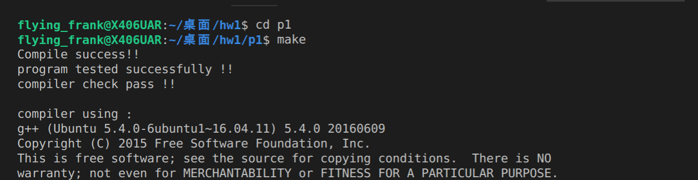

# DSnP_2019fall #
Data Structure and Programming, 2019fall, NTUEE

## HW1 Preparation ##
p1: environment

p2: read in a “.json” file and perform some operations

Supported commands are listed below.
* Read 
* Print
* Add
* Sum
* Ave
* Max
* Min

## HW2 Command reader ##
design a command reader “cmdReader” for keyboard input and file input.

Supported commands are listed below.
* Printable character
* Ctrl-a (LINE_BEGIN_KEY) or Home (HOME_KEY)
* Ctrl-e (LINE_END_KEY) or End (END_KEY)
* Backspace (<-) (BACK_SPACE_KEY)
* Delete key (DELETE_KEY)
* Tab key (TAB_KEY)
* Enter  (NEWLINE_KEY)
* Up arrow (ARROW_UP_KEY) or PgUp (PG_UP_KEY)
* Down arrow (ARROW_DOWN_KEY) or PgDn (PG_DN_KEY)

## HW3 Complete UI ##
design a more complete user interface (on top of HW2) for a simple command-line database system (similar to HW1).

Supported commands are listed below.
* DBAPpend: append a JSON element (key-value pair(s)) to the end of DB
* DBAVerage: compute the average of the DB
* DBCount: report the number of JSON elements in the DB
* DBMAx: report the maximum JSON element
* DBMIn: report the minimum JSON element
* DBPrint: print the JSON element(s) in the DB
* DBRead: read data from .csv file
* DBSOrt: sort the JSON object by key or value
* DBSUm: compute the summation of the DB
* DOfile: execute the commands in the dofile
* HELp: print this help message
* HIStory: print command history
* Quit: quit the execution

## HW4 Memory manager ##
create a memory manager and its test program on top of the software system of HW3.

Supported commands are listed below.(Other than commands in HW3)
* MTReset: (memory test) reset memory manager
* MTNew: (memory test) new objects
* MTDelete: (memory test) delete objects
* MTPrint: (memory test) print memory manager info
* USAGE: report the runtime and/or memory usage

## HW5 Abstract data types ##.
implement various ADTs including “doubly linked list”, “dynamic array” and “binary search tree”.

All the ADTs should contain the following member functions: begin(), end(), empty(), size(), pop_front(), pop_back(), erase(), find(), and clear().

Supported commands are listed below.
* ADTReset: (ADT test) reset ADT
* ADTAdd: (ADT test) add objects
* ADTDelete: (ADT test) delete objects
* ADTQuery: (ADT test) Query if an object exists
* ADTSort: (ADT test) sort ADT
* ADTPrint: (ADT test) print ADT

## HW6 And-Inverter Graph ##
implement a special circuit representation, called “AIG” (And-Inverter Graph), from a circuit description file.

Supported commands are listed below.
* CIRRead: read in a circuit and construct the netlist
* CIRPrint: print circuit
* CIRGate: report a gate
* CIRWrite: write the netlist to an ASCII AIG file (.aag)

## HW7 Task manager ##
Implement a task manager using heap and hash.

Supported commands are listed below.
* TASKAssign: Assign load to the minimum task node(s)
* TASKInit: Initialize task manager
* TASKNew: Add new task nodes
* TASKQuery: Query task manager
* TASKRemove: Remove existing task nodes

## Final Project FRAIG ##
implement Functionally Reduced And-Inverter Graph (FRAIG).
cd 
